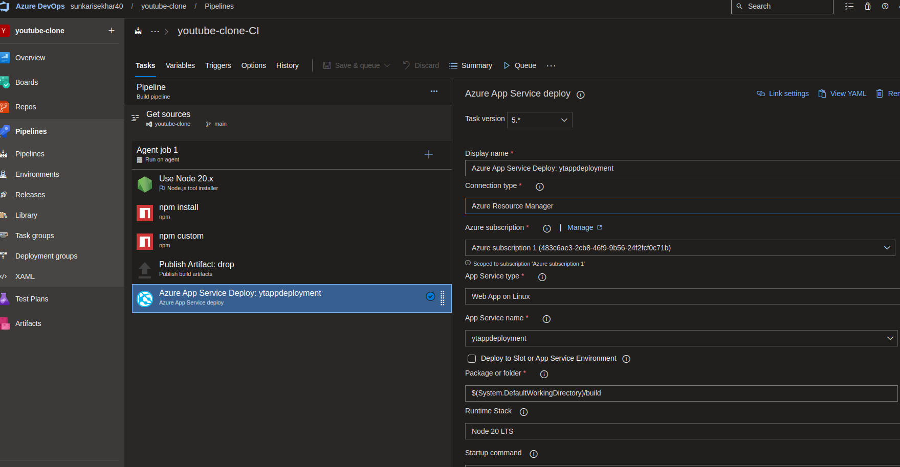
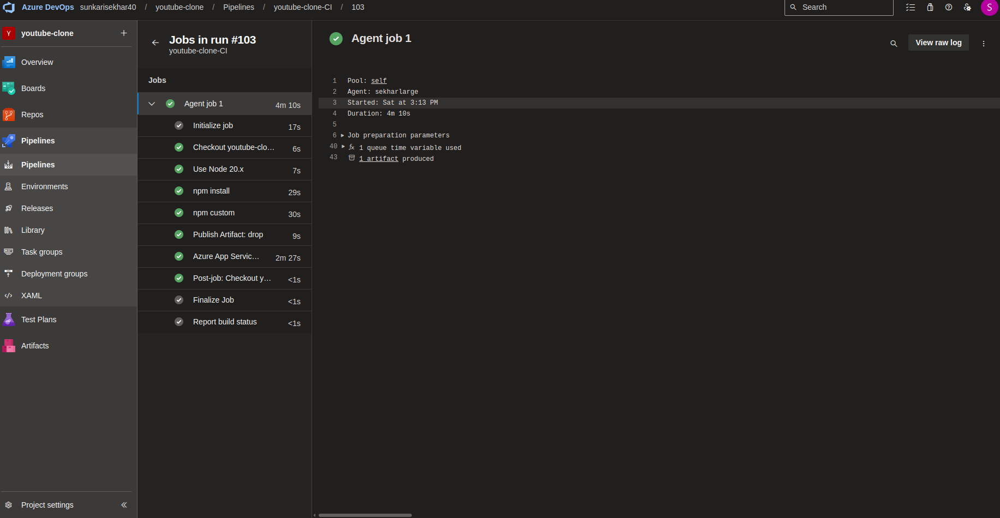
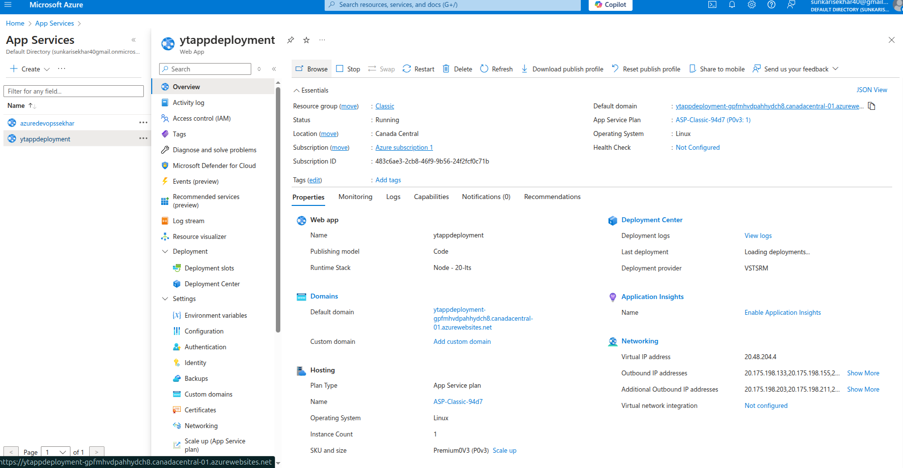

# Build and Deploy a Modern YouTube Clone Application in React JS with Material UI 5

# Azure Repos Youtube Clone Applocation Code

# Using Azure Pipelines Desgined a End to End Pipeline Using Classic Pipeline Editor.

# Successfull Pipeline Running in Azure Pipelines

# Deploying the Application into Azure App Service

# Final Result accessing the application using endpoint provided By Azure App Service.

